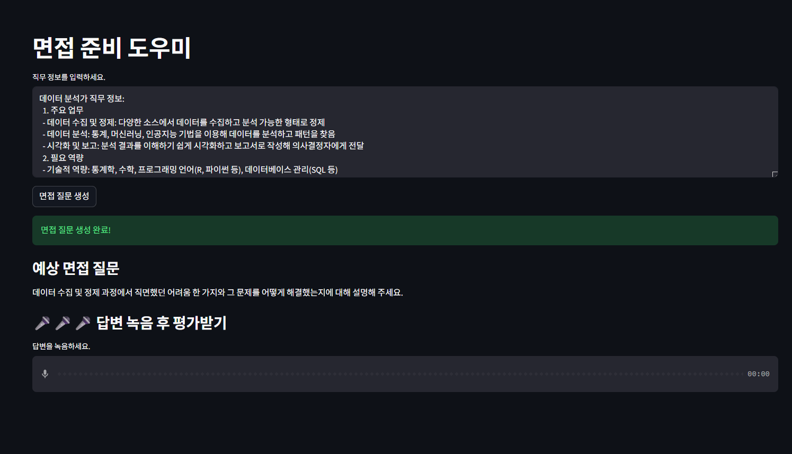
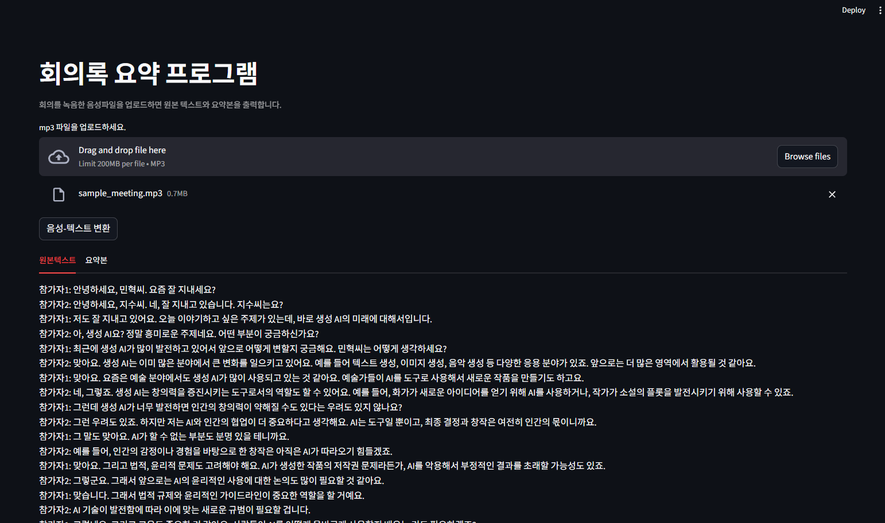
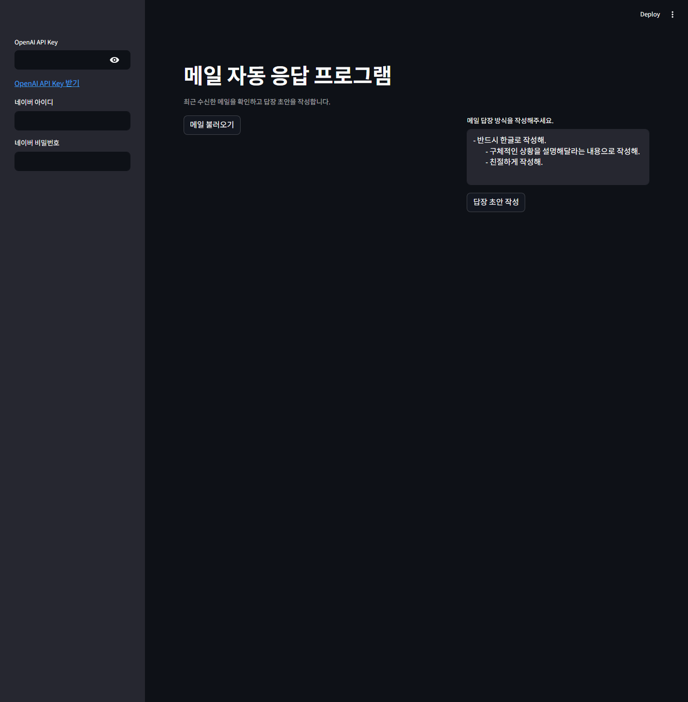
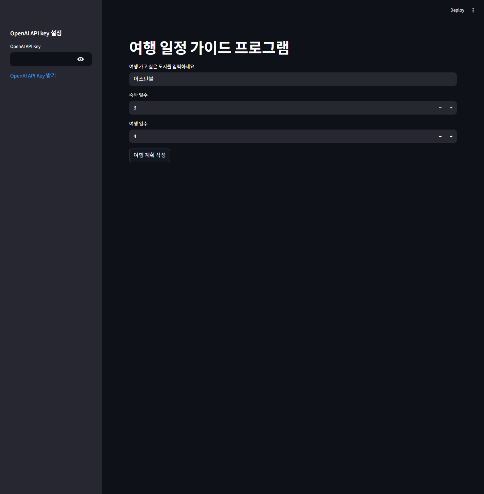
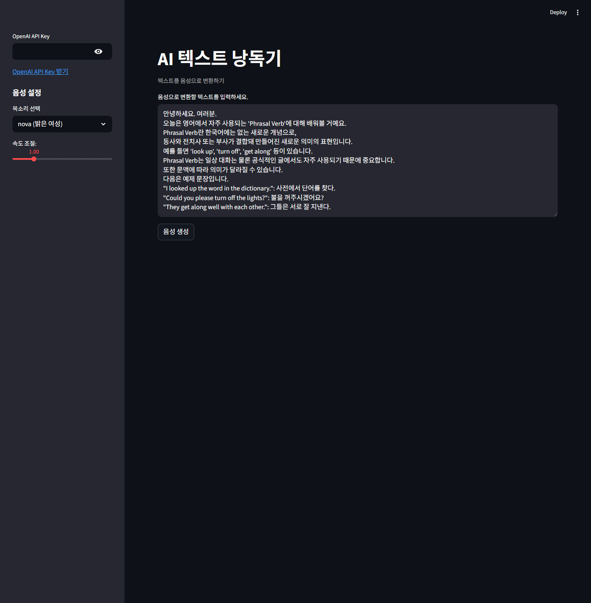
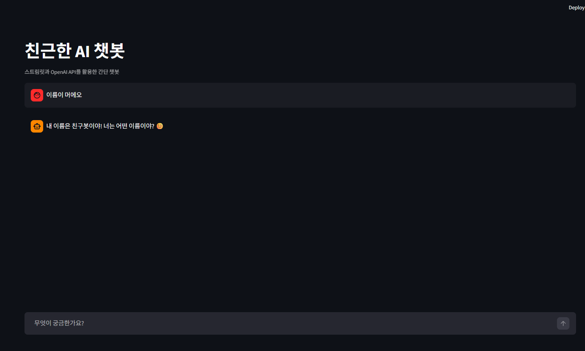
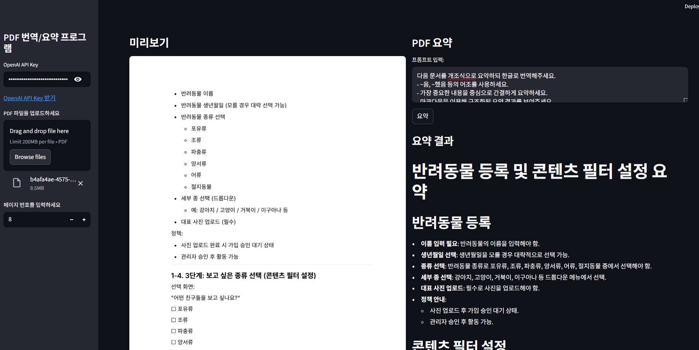
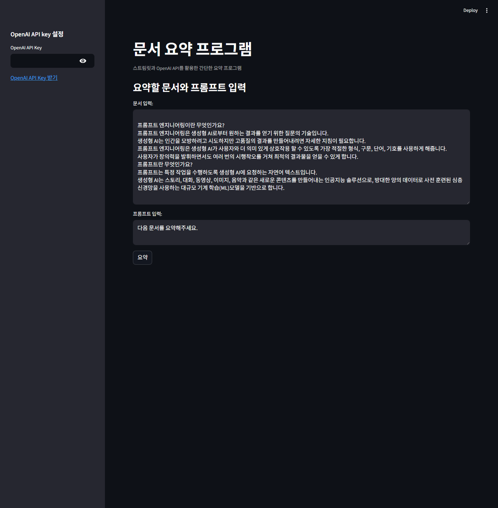
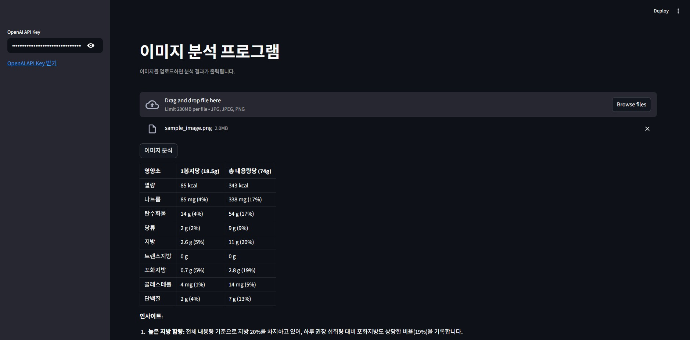
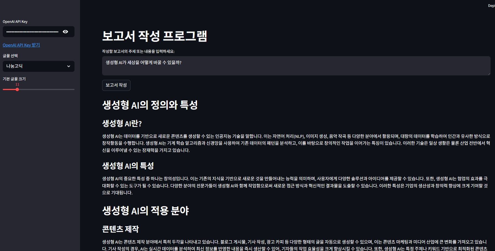

# AI Study

OpenAI API를 활용해 만든 실습용 Python 프로젝트 모음입니다.  
Streamlit 기반의 간단한 앱과 메일 처리 스크립트가 함께 들어 있습니다.

## 주요 기능

- `meeting_helper.py`: 직무 정보를 바탕으로 면접 질문을 생성하고, 녹음한 답변을 전사한 뒤 평가합니다.
- `meeting_summarize.py`: 회의 음성 파일을 텍스트로 변환하고 화자 형태로 정리한 뒤 요약합니다.
- `auto_mail_re.py`: 최근 수신 메일을 불러와 답장 초안을 생성하고 메일 회신까지 처리합니다.
- `trip_guide.py`: 도시와 여행 기간을 입력하면 일정과 이미지 프롬프트 기반 결과를 생성합니다.
- `tts.py`: 입력한 텍스트를 음성으로 변환합니다.
- 그 외 파일은 PDF 요약, 문서 생성, 챗봇 등 OpenAI 기능 실습용 스크립트입니다.

## 실행 환경

- Python 3.11 이상 권장
- Windows PowerShell 기준

## 설치

```powershell
python -m venv venv
.\venv\Scripts\Activate.ps1
pip install streamlit openai python-dotenv pandas
```

기능에 따라 추가 패키지가 더 필요할 수 있습니다.

## 환경변수

프로젝트 루트의 `.env` 파일을 사용합니다.

- `OPENAI_API_KEY`: OpenAI 기능을 사용하는 앱에서 필요합니다.
- `NAVER_ID`, `NAVER_PASSWORD`: 네이버 메일 수신/회신 기능에서 사용합니다.

## 실행 방법

Streamlit 앱은 아래처럼 실행합니다.

```powershell
streamlit run meeting_helper.py
streamlit run meeting_summarize.py
streamlit run auto_mail_re.py
streamlit run trip_guide.py
streamlit run tts.py
```

일반 Python 스크립트는 아래처럼 실행합니다.

```powershell
python auto_mail_re1.py
python test_openai.py
```

## 화면 미리보기

### `meeting_helper.py`



### `meeting_summarize.py`



### `auto_mail_re.py`



### `trip_guide.py`



### `tts.py`



### `chatbot.py`



### `pdf_reading.py`



### `summarize_test.py`



### `analysis_img.py`



### `make_docx.py`



## 파일 구성

- `meeting_helper.py`: 면접 질문 생성, 답변 녹음, 전사, 평가
- `meeting_summarize.py`: 회의 음성 텍스트 출력 및 요약
- `auto_mail_re.py`: 메일 조회, 답장 초안 생성, 회신
- `auto_mail_re1.py`: 단일 메일 전송 테스트 스크립트
- `trip_guide.py`: 여행 일정 생성
- `tts.py`: 텍스트 음성 변환
- `pdf_reading.py`, `summarize_test.py`: PDF/문서 요약 실습
- `chatbot.py`, `analysis_img.py`, `make_docx.py`: 기타 OpenAI 기능 실습

## 주의사항

- `.env` 파일에는 실제 계정 정보와 API 키가 들어가므로 Git에 올리지 않도록 주의합니다.
- 네이버 메일 기능 사용 시 IMAP/SMTP 접근 설정이 필요합니다.
- OpenAI API 사용량에 따라 비용이 발생합니다.

## 참고

- 입문자를 위한 맞춤형 AI 프로그램 만들기(길벗)
